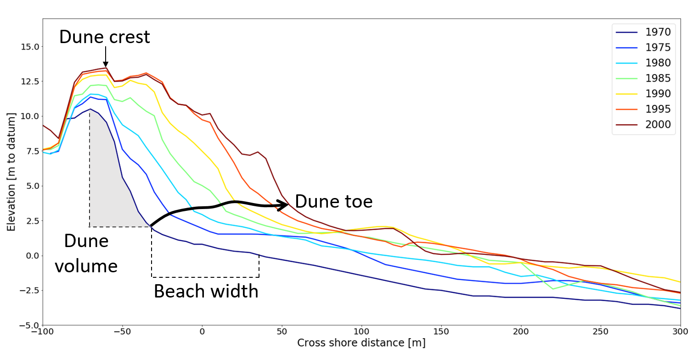

Jarkus Analysis Toolbox documentation
=======================================

The Jarkus Analysis Toolbox (JAT) is a Python-based open-source software, that can be used to analyze the Jarkus dataset. The Jarkus dataset is one of the most elaborate coastal datasets in the world and consists of coastal profiles of the entire Dutch coast, spaced about 250-500 m apart, which have been measured yearly since 1965. The main purpose of the JAT is to provide stakeholders (e.g. scientists, engineers and coastal managers) with the techniques that are necessary to study the spatial and temporal variations in characteristic parameters like dune height, dune volume, dune foot, beach width and closure depth. Different available definitions for extracting these characteristic parameters were collected and implemented in the JAT. 

The software that is described in this documentation can be found in this `Github repository`_. Additionally, the extracted parameters for the entire Jarkus dataset are made available through the `4TU repository`_. 

.. _Github repository: https://github.com/christavanijzendoorn/JAT
.. _4TU repository: https://github.com/christavanijzendoorn/JAT

..

    | Example of characteristic parameters that can be extracted using the **JAT**.

Contents
==================
.. toctree::
   :maxdepth: 2
   
   Method
   Gettingstarted
   Examples 
   CharacteristicParameters
   Functionalities
   Help
   